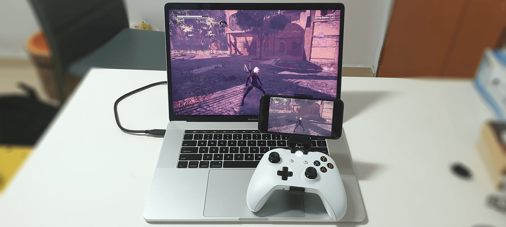
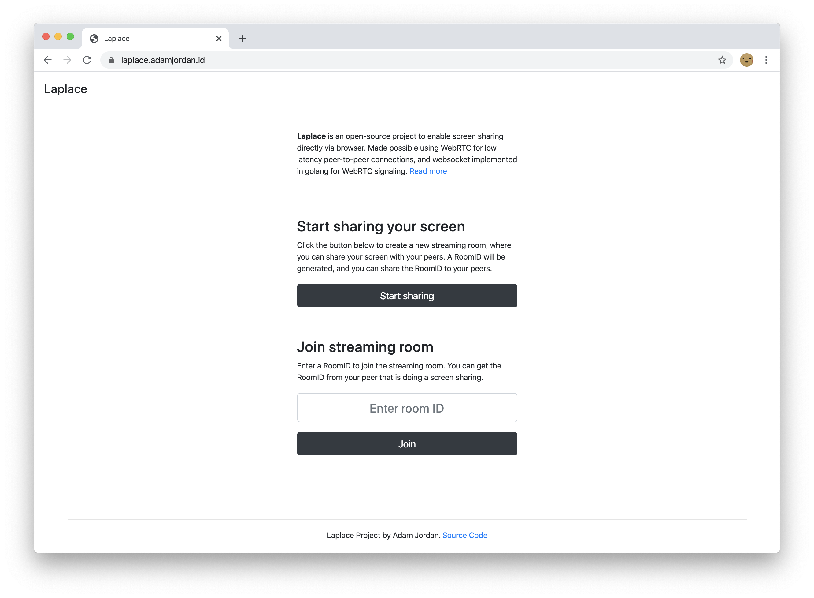

# Laplace

Laplace is an open-source project to enable screen sharing directly via browser.
Made possible using WebRTC for low latency peer-to-peer connections, and WebSocket implemented in golang for WebRTC signaling.

> Demo video: https://youtu.be/E8cUaPrAlzE

[](https://youtu.be/E8cUaPrAlzE)


## Try Demo

For demo, you can visit https://laplace.madeby.monster/




## Motivation

There are already possible solutions to share your computer screen, e.g. TeamViewer.
But most of them require installations of software or plugins.
What Laplace provides is a simple solution to this problem.
For users wanting to share their screen, all they need to do is to open a website page with their browsers, clicking some buttons, then share some session ID with their peers.

#### Solving the latency problem

This project also serves as a proof-of-concept (PoC) for screen sharing capability directly in browsers based on WebRTC.
Using WebRTC, real-time communication is made possible through peer-to-peer connections.
This proves to be very useful in solving one of the biggest problems is screen streaming: **Latency**. 
The latency represents how long the delay is from the source to transmit to the remote client.
If you notice, this latency problem is usually highlighted by game streaming services, since gameplay relies heavily on the interactivity of inputs and outputs.


#### Low server cost 
This solution also solves the server cost problem, since the expensive operations (encoding and transmission) are done on client browsers.
The server is only needed for serving frontends and for WebRTC signaling.


#### Possible Use Cases

- Game streaming from PC to mobile devices.
- Collaborative work where you need to share your screen with remote coworkers.
- Mirroring presentation slides and demonstrations.


## Installation


### Installation required to share keyboard and mouse
To do this we ensure that the client either has has a IPV6 
address or a public IPV4 address. 
We use the use the popular open repository known as [Barrier KVM](https://github.com/debauchee/barrier). 

#### What is Barrier kvm?

Barrier is software that mimics the functionality of a KVM switch, which historically would allow you to use a single keyboard and mouse to control multiple computers by physically turning a dial on the box to switch the machine you're controlling at any given moment. Barrier does this in software, allowing you to tell it which machine to control by moving your mouse to the edge of the screen, or by using a keypress to switch focus to a different system.

#### Barrier KVM build status and links to install 
|Platform       |Build Status|
|            --:|:--         |
|Linux          |[](https://dev.azure.com/debauchee/Barrier/_build/latest?definitionId=1&branchName=master)|
|Mac            |[](https://dev.azure.com/debauchee/Barrier/_build/latest?definitionId=1&branchName=master)|
|Windows Debug  |[](https://dev.azure.com/debauchee/Barrier/_build/latest?definitionId=1&branchName=master)|
|Windows Release|[](https://dev.azure.com/debauchee/Barrier/_build/latest?definitionId=1&branchName=master)|
|Snap           |[](https://build.snapcraft.io/user/debauchee/barrier)|


### Build from source

```bash
$ git clone https://github.com/adamyordan/laplace.git
$ cd laplace && go build -o laplace main.go
$ export LAPLACE = $PATH
$ ./laplace --help
$ ./laplace -setconfig 
```

### OR, pull the pre-built docker image (Barrier KVM not supported yet) 

```bash
$ docker pull adamyordan/laplace
$ docker run adamyordan/laplace ./laplace --help
```


## Program Execution

Executing this project basically serves an HTTP server that will host the frontend and the WebSocket implementation.
Note that you sometimes need to run HTTPs in order for browser to connect to websocket.

```bash
$ ./laplace --help
  -addr string
    	Listen address (default "0.0.0.0:443")
  -certFile string
    	TLS cert file (default "files/server.crt")
  -keyFile string
    	TLS key file (default "files/server.key")
  -setconfig
    	Generates a config file
  -tls
    	Use TLS
```

By default, you can run the executable without any argument to listen to TLS port 443.
A self-signed certificate files are provided to ease up development. If you want to run 
with barrier KVM. Run as non-root. 

```bash
$ ./laplace -tls
2020/03/25 01:01:10 Listening on TLS: 0.0.0.0:443
```

You can then open https://localhost:443/ to view Laplace page.
You may need to add certificate exceptions. In Chrome, you can type `thisisunsafe`.


## Contributing

Pull requests are welcome. For major changes, please open an issue first to discuss what you would like to change.


## License

[MIT](https://choosealicense.com/licenses/mit/)
